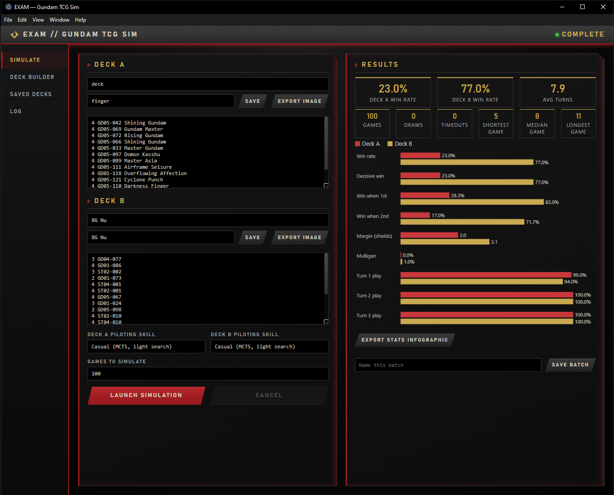
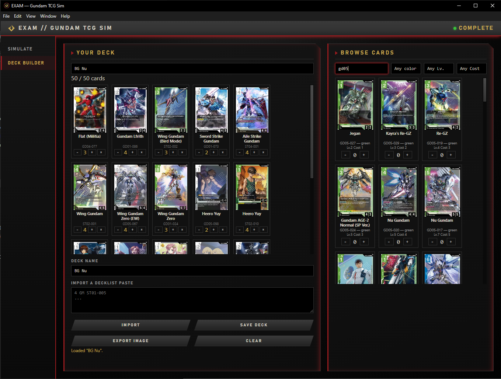
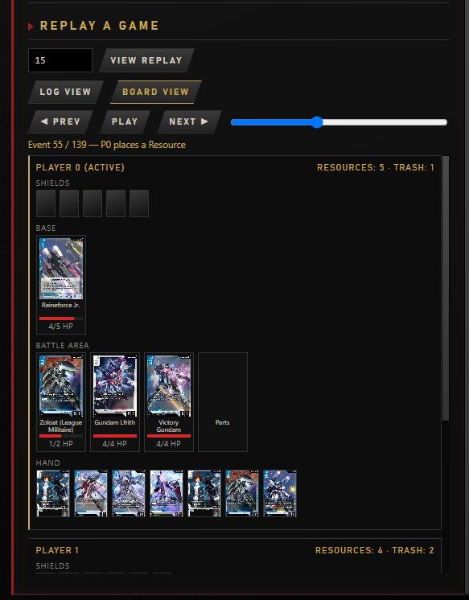
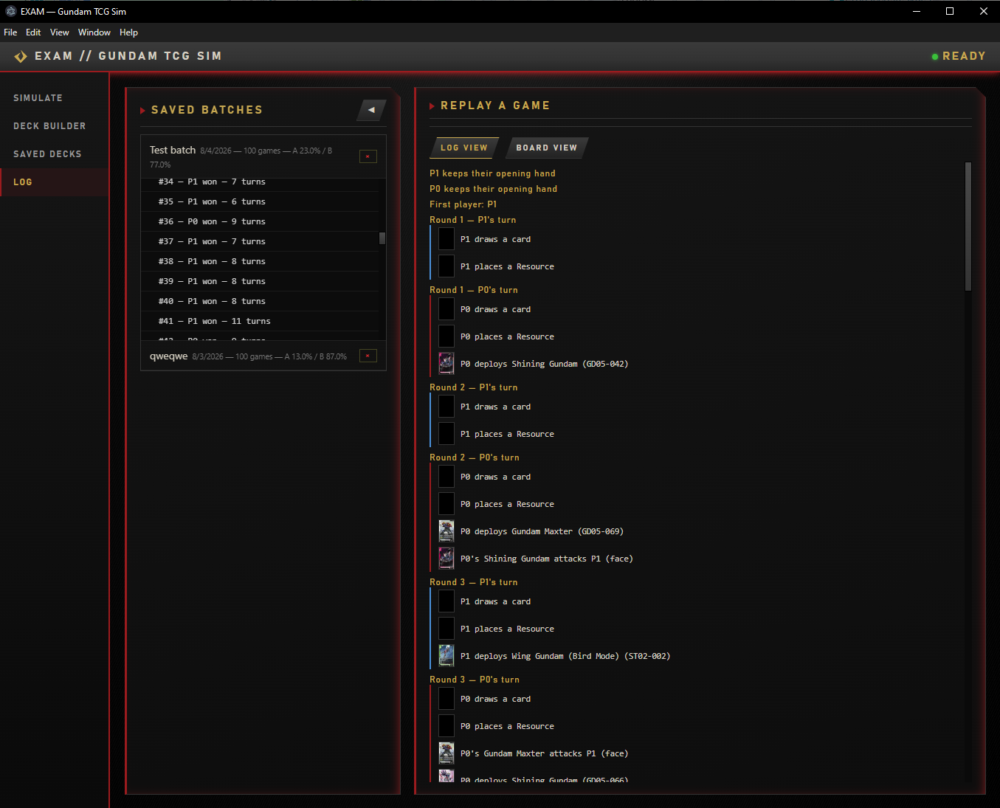
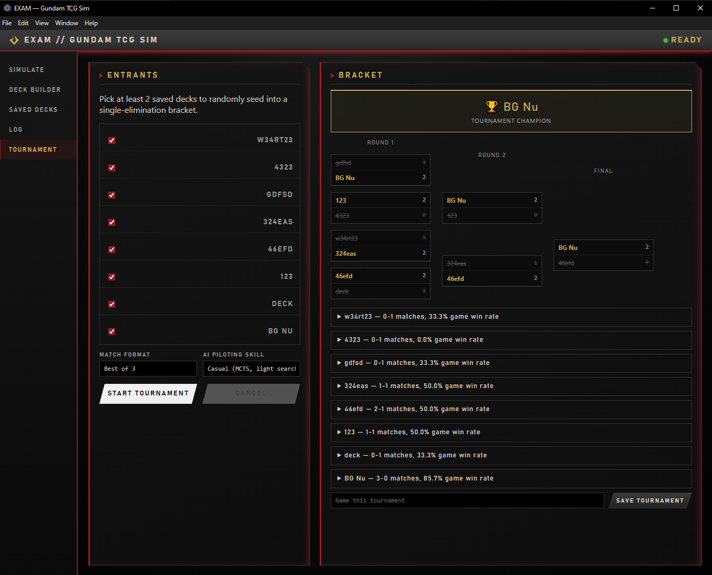

# EXAM: Gundam TCG Sim

I built this because I wanted a real answer to "how does this deck actually perform," not just whether it goldfishes okay. It's a Windows desktop app that plays out full games of the Gundam Card Game between two decklists you paste in, hundreds or thousands of them if you want, unattended, and hands back real stats: win rate, mulligan rate, opening hand curve, game length.

It's built against the official Comprehensive Rules and the current banned/restricted list. Every card's effect comes from its real, researched text. Nothing's guessed, and nothing's left as a generic vanilla stat line.

### [⬇ Download EXAM for Windows](https://github.com/Harbl/EXAM-Gundam-Simulation/releases/latest)

Grab the installer from the [latest release](https://github.com/Harbl/EXAM-Gundam-Simulation/releases/latest), run it, pick an install location. After that the app checks for a newer version on every launch. When one's out, a small banner shows up so you can download and install it in one click, right from inside the app.

## Features

**Batch simulation with a real opponent, not a coin flip.** Paste two decklists, pick a game count, hit Launch. Both sides are piloted by [Monte Carlo Tree Search](src/ai/mcts.js), so the AI is actually searching deploys, pairs, Commands, and attacks as one decision tree per turn, not running a fixed "always curve out first" script. Five skill tiers trade search strength for speed, so a quick 1,000-game batch and a "play this one game as strong as possible" run are both practical.

**Stats you can actually read.** Win rate, decisive-win rate, win rate on the play vs. the draw, margin of victory (shields left), mulligan rate, turn 1/2/3 curve consistency, deck A vs. deck B side by side as a hand-rolled bar chart. Export any run as a shareable PNG matchup report with the deck lists attached.

**A real Deck Builder, not just a text box.** Browse and filter the full card database by name, color, level, or cost, with real card art. Live legality feedback (copy limits, banlist, color count) while you build. Save decks by name, reload them later, or paste a decklist straight into the builder to edit it.

**Watch any simulated game play out, turn by turn.** Every batch remembers each game's seed, so any individual game is exactly reproducible. The replay viewer has two modes: a text log, or a full visual board, both players' hands revealed, Shields flipping face up as they're hit, Bases and Resources shown with real card art (down to Unit Tokens and the EX Base/EX Resource every game starts with), Resources tapping as they're spent, HP bars draining in real time, units physically flying from hand to the battle area on deploy, tapping when they attack or block, and flying off to the trash on destruction. Step through it event by event or just hit play.

**Every batch you save sticks around.** The Log page lists every batch you've ever saved, deck names, game count, win rate at a glance, and picking one loads its full game-by-game results back in, ready to replay any individual game the same way as a batch you just finished.

**Run a tournament, single or double elimination.** Pick any of your saved decks as entrants, choose a Best of 1/3/5/7 match format and an AI skill tier, and EXAM randomly seeds a bracket and plays it out round by round, revealing each winner into the next round as soon as their match resolves. In double elimination a loss doesn't knock you out right away, you drop into a losers bracket and the two bracket champions meet in a Grand Final. Save the finished bracket to the Log page alongside your batches, with per-entrant match/game win rates and every individual game still replayable.

